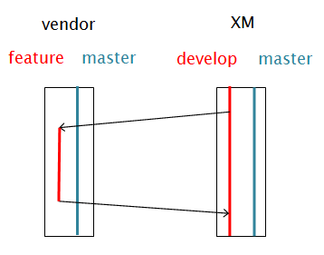
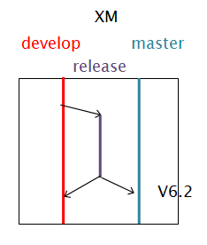
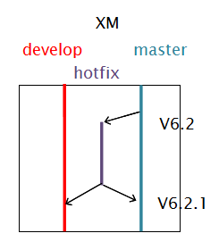

X-Road Joint Development
# Workflow Policy

DRAFT v0.7

##1	General

1.1	This document establishes workflow policy for collaborative and open source software development of X-Road software. Workflow Policy strives to serve as a handbook or charter for all practical aspects of development.

1.2	Workflow is understood as systematic arrangement of work, a complex of processes, practices, roles and responsibilities, communication patterns, and artefacts.

1.3	Goals of the workflow policy are to: establish productive and secure collaborative open source working environment; assure production of high quality software; avoid duplication of effort, facilitate re-use of software; transparency and openness; broader community of developers; use of software development best practice; clear communication among Partners as well as other stakeholders in the X-Road development process; innovation.

1.4	Workflow implements the higher-level agreements of "X-Road Change Management Process" [Change Management Process].

1.5	X-Road development uses a collaborative model based on Git distributed version control system [Git].

##2	Repositories

2.1	Master Repository - short name: `XM`; hosted by: RIA; purpose: release of X-Road software; access: Head Architect has write access; read access is given to development and maintenance personnel assigned by Partners.

2.2	Open Source Repository - short name: `XO`; hosted at: GitHub; purpose: open access publication of select parts of X-Road software; administered by: VRK; access: Head Architect has write access; everybody has read access.

2.3	Vendor repositories - purpose: development work carried out by Vendor; administered by: Vendor.

2.4	Partners can establish their own, additional repositories, for backup, software distribution or other purposes.

## 3	Branching pattern

3.1	Branching pattern follows the Gitflow model [Gitflow] [Driessen]. Two perpetual branches – `master` and `develop` – together with three additional branches – `feature`, `release` and `hotfix` – are used.

3.2	`master` branch is used to release X-Road software into production. `develop` branch is used to accumulate features for the next big release. `feature` branches are used to work on features (or closely related sets of features) to enhance X-Road core software. New production release is prepared on `release` branch. Patches are prepared on `hotfix` branches.

## 4	Feature development and integration

4.1	Partners co-ordinate development by X-Road Roadmap (see [Change Management Process]).

4.2	Vendors develop software in their repositories, on `feature` branches.

4.3	Procedure:

a)	Vendor creates `feature` branch in vendor repository by branching from `XM/develop`;

b)	Upon completion of feature development, Vendor sends a pull request to `XM/develop`.

c)	Head Architect reviews the pull request according to acceptance criteria:

- Are the features OK to be accepted to the core (Feature analysis)?
- Does the code conform to the X-Road non-functional requirements(see [Non-Functional Requirements])?
- Is the version number correct (as agreed on the roadmap)?
- Have the changelogs been updated?
- Does the build and the test cases work? (CI build)
- Is there enough test coverage?
- Have the X-Road coding conventions been used?
- Is the code commented well enough?
- Are the JavaDocs OK?
- Is the code licensing OK?
- Has the documentation been updated?
- Does it include the reference to the 'backlog' item?
- Does it have a correct version number (according to Charter)?

d)  When the acceptance criteria is satisfied the Head Architect pulls in from Vendor repository into `XM/develop`.

## 5	Release preparation

5.1	New production release is prepared on `release` branch.

5.2	Jointly developed X-Road software is released by the procedure:

a)	Head Architect creates a `release` branch from `XM/develop`.

b)	both Partners thoroughly review the software to be released.

c)	Steering Committee decides to release, including the version number (see [Change Management Process], sections “Release sequence” and “Version compatibility”).

d)	Head Architect pushes software from `XM/release` into `XM/master` and tags the commit with version number.

e)	Head Architect also updates `XM/develop` with changes made on `release` branch.

5.3	New release also will be updated into X-Road Open Source repository (`XO`).	 

## 6	Deployment

6.1	Partners can fetch released software into Partner repositories. Partner repositories serve as distribution points for Partner country organisations.

## 7	Hotfix

7.1	Critical bug in production version is handled by preparation and release of a patch. 

7.2	Patch is prepared on `hotfix` branch.

7.3	Hotfix procedure:

a)	Head Architect creates a `XM/hotfix` branch from `XM/master`.

b)	A Partner is assigned to prepare a patch (see [Change Management Process], section “Warranty”).

c)	Partner, possibly using a Vendor, prepares the patch and commits it to `XM/hotfix`.

d)	Head Architect reviews the patch.

e)	Head Architect merges `XM/hotfix` into `XM/master` and tags the commit with version number.

f)	Head Architect merges changes made into `XM/hotfix` into `XM/develop`.	 

## 8	Setting up repositories	

8.1	Repositories are set up according to the process:

a)	Head Architect sets up the Master Repository `XM`. Repository is initialised by committing X-Road v6.0 software into the `master` branch.

b)	Head Architect creates `develop` branch in `XM`.

c)	VRK creates repository `XO` and initialises it by committing X-Road v6.0 Security Server software and documentation into the repository.

## 9	Open source development

9.1	Open source development and Partner development are only loosely coupled. Open source repository `XO` is open to everybody for forking. VRK administers the open source repository `XO`, in consultation with RIA and X-Road Developer Community.

9.2	New branches are created in `XO` by Manager of `XO` as needed.

9.3	Pull requests into `XO` are reviewed and accepted by Manager of `XO`.

9.4	Manager of `XO` periodically updates `XO` with new content from `XM`.

9.5	Good quality and useful results of open source development can be integrated into `XM`. Exact procedure is out of scope of this document. 
9.6 In cases of justified need, developers can request for up o 2 week 'code freeze' in develop branch of XM from Head Architect.
9.7 Up to 4 weeks 'code freeze' period can be applied to master branch of XM by approval of Head Architect.

## 10	Documentation policy

10.1	X-Road joint documentation is produced in English. Partners are free to translate documentation into national languages.

10.2	Production format for documentation is GitHub Flavoured Markdown [Markdown].

10.3	Partners can publish X-Road documentation on their own websites, either verbatim or in part. Partners can modify and extend the documentation as they consider fit for their uses.

## 11	Approval, publication and amendment

11.1	Workflow Policy is approved by the Partners on the basis of consensus.

11.2	Current version of Workflow Policy is made public in GitHub, https://github.com/e-gov/Workflow. 

11.3	Workflow will be amended as needed. All participants of the development can propose to amend Workflow Policy. Amendment proposal can be submitted by raising an issue or submitting a pull request in GitHub.

11.4	Head Architect brings proposal to Partner Steering Committee who decides to accept or reject the proposal. 

## 12	References
[BitBucket] BitBucket Server. Controlling access to code. https://confluence.atlassian.com/bitbucketserver/controlling-access-to-code-776639770.html.

[Change Management Process] X-Road Change Management Process. v0.92, 6.10.2015.

[Git] Git distributed version control system, https://git-scm.com/. 

[Gitflow] Atlassian, Comparing workflows, Gitflow workflow, https://www.atlassian.com/git/tutorials/comparing-workflows/gitflow-workflow.

[GitHub Organization] Github.com, Introducing Organisations, https://github.com/blog/674-introducing-organizations. 

[Driessen] Driessen V (2010) A successful Git branching model, http://nvie.com/posts/a-successful-git-branching-model/.

[Markdown] GitHub.com, GitHub Flavored Markdown, https://help.github.com/articles/github-flavored-markdown/. 

[Stash] Atlassian.com, Code, Manage, Collaborate, https://www.atlassian.com/software/bitbucket. 

[Non-Functional Requirements] X-Road Non-Functional Requirements
